<a name="HOLTitle"></a>
# Azure Batch Service with Batch Shipyard #

---	

<a name="Overview"></a>
## Overview ##

[**Azure Batch**](https://azure.microsoft.com/en-us/services/batch/) is a service that enables you to run batch processes on high-performance computing (HPC) clusters composed of Azure virtual machines (VMs). Batch processes are ideal for handling computationally intensive tasks that can run unattended such as photorealistic rendering and computational fluid dynamics. Azure Batch uses [VM scale sets](https://docs.microsoft.com/en-us/azure/virtual-machine-scale-sets/virtual-machine-scale-sets-overview) to scale up and down and to prevent you from paying for VMs that aren't being used. It also supports autoscaling, which, if enabled, allows Batch to scale up as needed to handle massively complex workloads.

Azure Batch involves three important concepts: **storage**, **pools**, and **jobs**. Storage is implemented through Azure Storage, and is where data input and output are stored. Pools are composed of compute nodes. Each pool has one or more VMs, and each VM has one or more CPUs. Jobs contain the scripts that process the information in storage and write the results back out to storage. Jobs themselves are composed of one or more tasks. Tasks can be run one at a time or in parallel.

**[Batch Shipyard](https://github.com/Azure/batch-shipyard)** is an open-source toolkit that allows Dockerized workloads to be deployed to Azure Batch compute pools. Dockerized workloads use Docker containers rather than VMs. (Containers are hosted in VMs but typically require fewer VMs because one VM can host multiple container instances.) Containers start faster and use fewer resources than VMs and are generally more cost-efficient. For more information, see https://docs.microsoft.com/en-us/azure/virtual-machines/windows/containers.

The workflow for using Batch Shipyard with Azure Batch is pictured below. After creating a Batch account and configuring Batch Shipyard to use it, you upload input files to storage and use Batch Shipyard to create Batch pools. Then you use Batch Shipyard to create and run jobs against those pools. The jobs themselves use tasks to read data from storage, process it, and write the results back to storage.


_Azure Batch Shipyard workflow_

In this lab, you will use Azure Batch and Batch Shipyard to process a set of text files containing chapters from a famous novel and generate .ogg sound files from the text files.

**Note**: This lab requires an Internet connection with a minimum upload speed of approximately 1 MB/sec or higher. If you don't have that, or if the lab fails in Exercise 6, try creating a Windows VM in Azure and working the lab in the VM. You will find instructions for creating a Windows VM in Azure at https://docs.microsoft.com/en-us/azure/virtual-machines/windows/quick-create-portal.

<a name="Objectives"></a>
### Objectives ###

In this hands-on lab, you will learn how to:

- Create an Azure Batch account
- Configure Batch Shipyard to use the Batch account
- Create a pool and run a job on that pool
- View the results of the job
- Use the Azure Portal to remove the Batch account

<a name="Prerequisites"></a>
### Prerequisites ###

- An active Microsoft Azure subscription. If you don't have one, [sign up for a free trial](https://azure.microsoft.com/en-us/free/)

<a name="Resources"></a>
### Resources ###

[Click here](https://a4r.blob.core.windows.net/public/batch-resources.zip) to download a zip file containing the resources used in this lab. Copy the contents of the zip file into a folder on your hard disk.

<a name="Exercises"></a>
## Exercises ##

This hands-on lab includes the following exercises:

- [Azure Batch Service with Batch Shipyard](#azure-batch-service-with-batch-shipyard)
	- [Overview](#overview)
		- [Objectives](#objectives)
		- [Prerequisites](#prerequisites)
		- [Resources](#resources)
	- [Exercises](#exercises)
	- [Exercise 1: Create a Batch account](#exercise-1-create-a-batch-account)
	- [Exercise 2: Open the Cloud Shell](#exercise-2-open-the-cloud-shell)
	- [Exercise 3: Configure Batch Shipyard](#exercise-3-configure-batch-shipyard)
	- [Exercise 4: Create a pool](#exercise-4-create-a-pool)
	- [Exercise 5: Upload input files](#exercise-5-upload-input-files)
	- [Exercise 6: Run the job](#exercise-6-run-the-job)
	- [Exercise 7: View the results](#exercise-7-view-the-results)
	- [Exercise 8: Delete the resource group](#exercise-8-delete-the-resource-group)
	- [Summary](#summary)

Estimated time to complete this lab: **60** minutes.

<a id="Exercise1"/></a>
## Exercise 1: Create a Batch account ##

Azure Batch accounts can be created through the Azure Portal. In this exercise, you will create a Batch account and a storage account to go with it. This is the storage account that will be used for job input and output.

1. Open the [Azure Portal](https://portal.azure.com) in your browser. If you are asked to log in, do so using your Microsoft account.

1. Click **+ Create a resource**, followed by **Compute** and **Batch Service**.

	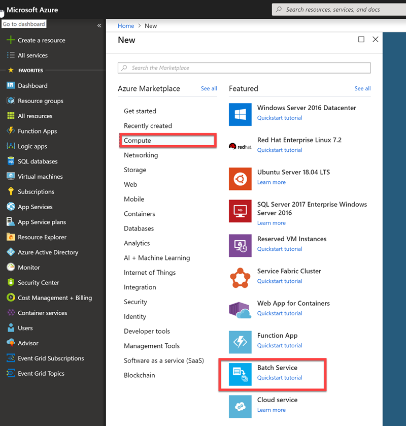

	_Creating a Batch service_

1. In the "New Batch account" blade, give the account a **unique** name such as "batchservicelab" and make sure a green check mark appears next to it. (You can only use numbers and lowercase letters since the name becomes part of a DNS name.) Select **Create new** under **Resource group** and name the resource group "BatchResourceGroup." Select the **Location** nearest you, and then click **Select a storage account**.

	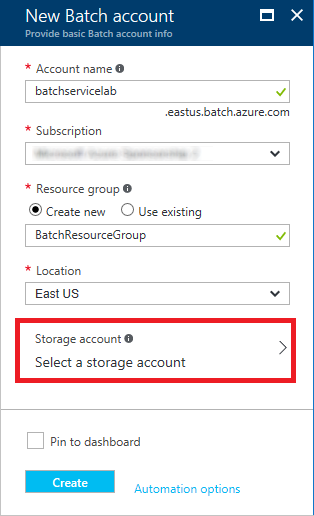

	_Entering Batch account parameters_

1. Click **Create new** to create a new storage account for the Batch service.

	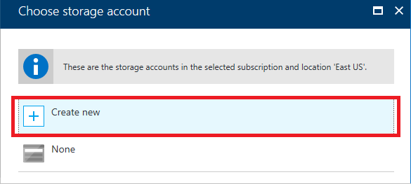

	_Creating a new storage account_

1. Enter a **unique** name for the storage account and make sure a green check mark appears next to it. Then set **Replication** to **Locally-redundant Storage (LRS)** and click **OK** at the bottom of the blade.

	> Storage account names can be 3 to 24 characters in length and can only contain numbers and lowercase letters. In addition, the name you enter must be unique within Azure; if someone else has chosen the same name, you'll be notified that the name isn't available with a red exclamation mark in the **Name** field.

	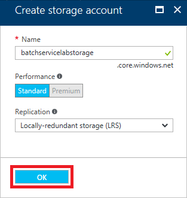

	_Creating a new storage account_

1. Click the **Create** button at the bottom of the "New Batch account" blade to start the deployment

	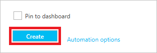

	_Creating a Batch account_

1. Click **Resource groups** in the ribbon on the left side of the portal, and then click the resource group created for the Batch account.
 
    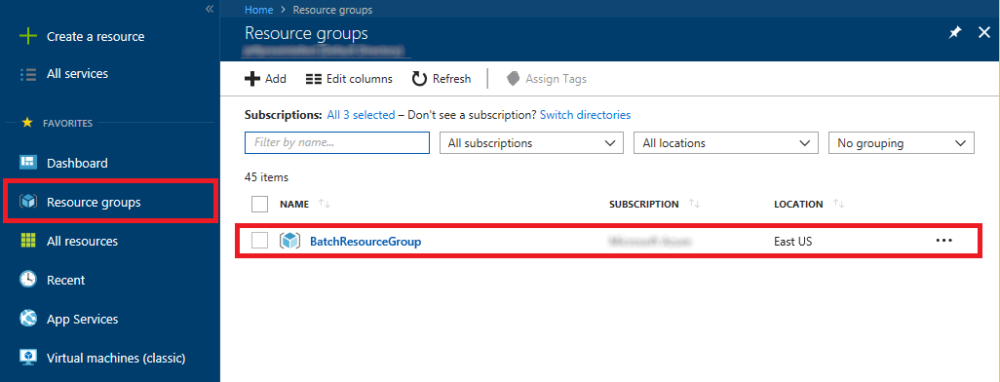

    _Opening the resource group_

1. Wait until "Deploying" changes to "Succeeded," indicating that the Batch account and the storage account have been deployed. You can click the **Refresh** button at the top of the blade to refresh the deployment status.

    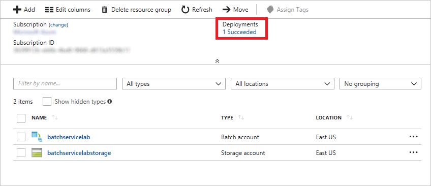

    _Viewing the deployment status_

<a id="Exercise2"/></a>
## Exercise 2: Open the Cloud Shell ##

1. In the Azure Portal go to the upper right side and open the Cloud Shell 

    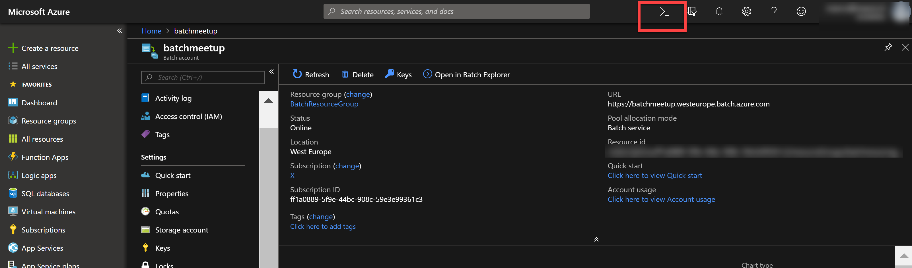

<a id="Exercise3"/></a>
## Exercise 3: Configure Batch Shipyard ##

Batch Shipyard uses YAML files named **config.yaml, pool.yaml,  jobs.yaml**, and **credentials.yaml** to configure the environment. These four files, the Dockerfiles used to build Docker images, the files referenced in the Dockerfiles, and a **readme.md** file define a Batch Shipyard "recipe."

Each of the configuration files in a recipe configures one element of Batch Shipyard. **config.yaml** contains configuration settings for the Batch Shipyard environment. **pool.yaml** contains definitions for the compute pools, including the VM size and the number of VMs per pool. **jobs.yaml** contains the job definition and the tasks that are part of the job. **credentials.yaml** holds information regarding the batch account and the storage account, including the keys used to access them.

In this exercise, you will modify **credentials.yaml** and **jobs.yaml** so they can be used in a Batch job. Rather than create a Dockerfile, you will use one that has been created for you. To learn more about Dockerfiles, refer to https://docs.docker.com/engine/getstarted/step_four/.

1. In the CLoud Shell (Using Bash) create a directory called "dutchazuremeeeutp" en go to this directory:
```
mkdir dutchazuremeetup

cd dutchazuremeetup
```

2. Now clone in here this repo: 
```
git clone XXX
```

3. Go to the folder "SmackYourBatchUp", then the folder "resources" and then to the folder "recipe"

4. Open the Cloud Shell Editor (don't forget the dot at the end): 
   ```
   code . 
   ```

5.From the Cloud Shell Editor open the "config" folder in that folder, and then open the file named **credentials.yaml** . There are two sections in the file: "batch" and "storage." The "batch" section contains the settings for the Batch account that Batch Shipyard will use. The "storage" section contains the settings Batch Shipyard will use to access the storage account created for the Batch account.

3. In the Azure Portal and to the "BatchResourceGroup" resource group created for the batch account in [Exercise 1](#Exercise`). In the resource group, click the Batch account.

	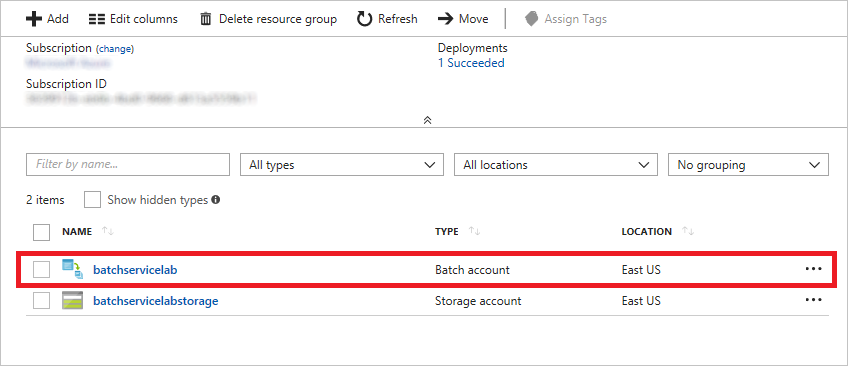

	_Opening the batch account_

1. Click **Keys**, and then click the **Copy** button next to the **Primary access key** field.

	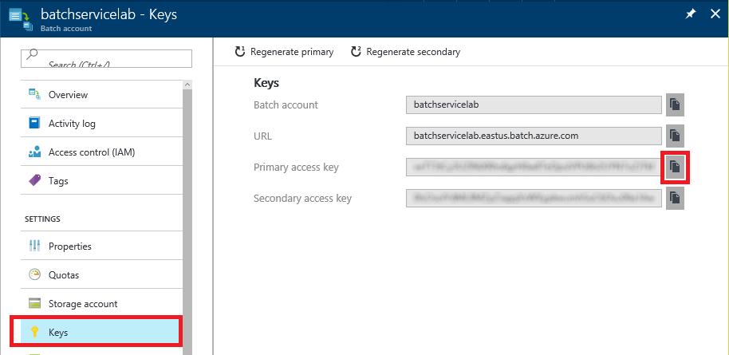

	_Copying the Batch account key_

1. Return to **credentials.yaml** and replace BATCH_ACCOUNT_KEY with the key that is on the clipboard.

1. In the blade for the Batch account, click the **Copy** button next to the **URL** field.

	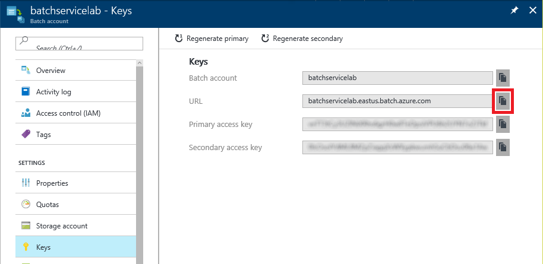

	_Copying the Batch account URL_

1. In **credentials.yaml**, replace BATCH_ACCOUNT_URL with the URL that is on the clipboard, leaving "https://" in place at the beginning of the URL. The "batch" section of **credentials.yaml** should now look something like this:

	```yaml
	batch:
	    account_key: ghS8vZrI+5TvmcdRoILz...7XBuvRIA6HFzCaMsPTsXToKdQtWeg==
	    account_service_url: "https://batchservicelab.westeurope.batch.azure.com
	```

1. In the Azure Portal, return to the "BatchResourceGroup" resource group and click the storage account in that resource group.

	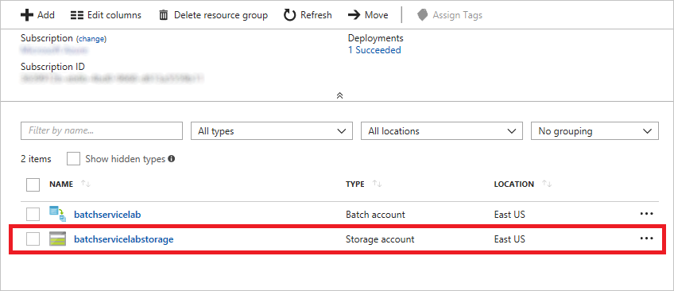

	_Opening the storage account_

1. Click **Access keys**, and then click the **Copy** button next to the **Storage account name** field.

	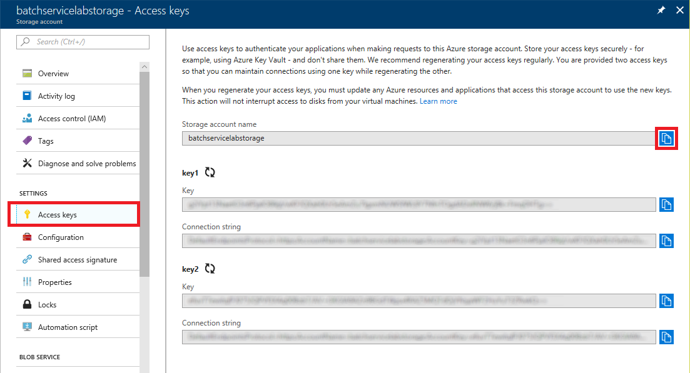

	_Copying the storage account name_

1. In **credentials.yaml**, replace STORAGE_ACCOUNT_NAME with the storage-account name that is on the clipboard.

1. Return to the portal and copy the storage account's access key to the clipboard.

	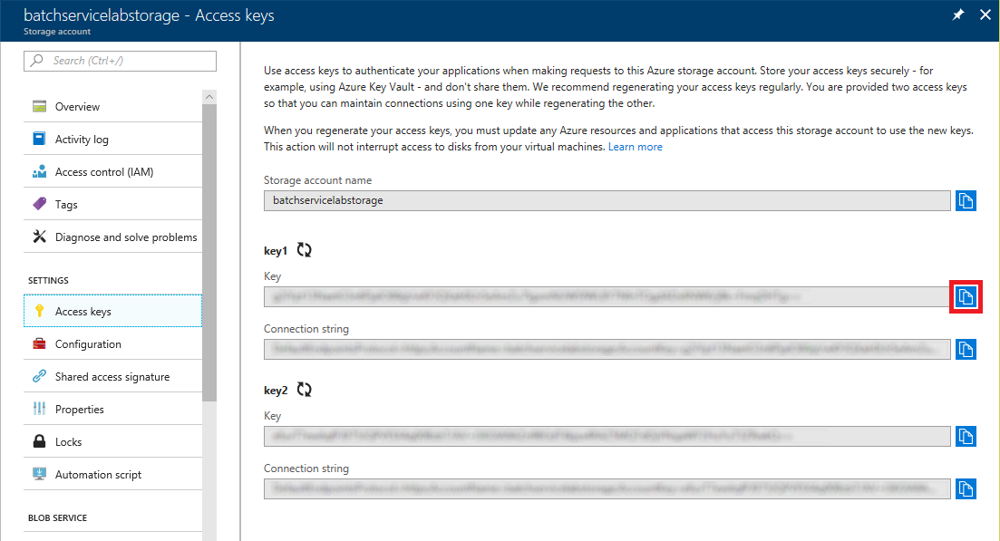

	_Copying the storage account key_

1. In **credentials.yaml**, replace STORAGE_ACCOUNT_KEY with the key that is on the clipboard, and then save (CTRL + S) the file. The "storage" section of **credentials.yaml** should now look something like this:

	```yaml
	storage:
	    mystorageaccount:
	        account: batchservicelabstorage
	        account_key: YuTLwG3nuaQqezl/rhEkT...Xrs8+UZrxr+TFdzA==
	        endpoint: core.windows.net
	```

1. Return to the portal and copy the storage account's connection string to the clipboard.

	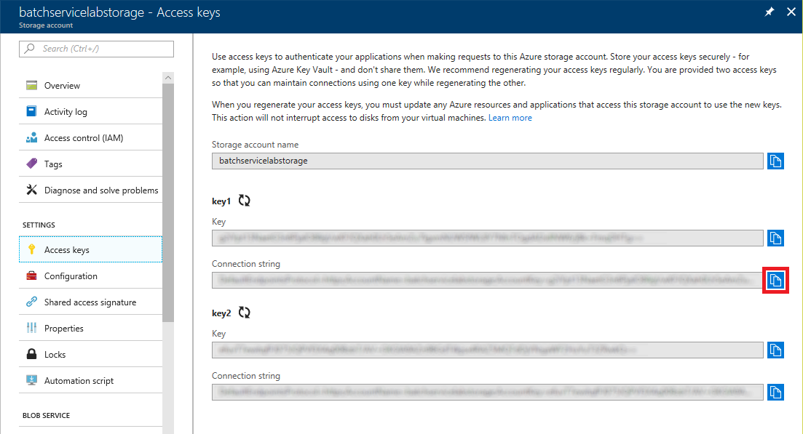

	_Copying the storage account connection string_

1. Open **jobs.yaml** and replace STORAGE_ACCOUNT_CONNECTION_STRING with the connection string that is on the clipboard. Then save (CTRL + S) the file. 

**credentials.yaml** and **jobs.yaml** now contain connection information for the Batch account and the storage account. The next step is to use another of the YAML files to create a compute pool.

<a id="Exercise4"/></a>
## Exercise 4: Create a pool ##

Before you run the job, you must create a compute pool using the configuration settings in **pool.yaml**. Batch Shipyard provides several commands for controlling Batch pools. In this exercise, you will use one of those commands to create a pool.

> The **pool.yaml** file provided for you configures each pool to have two VMs and specifies a VM size of STANDARD_A1, which contains a single core and 1.75 GB of RAM. In real life, you might find it advantageous to use larger VMs with more cores and more RAM, or to increase the number of VMs by increasing the *vm_count* property in **pool.yaml**.

1. In the Cloud Shell window that you left open, run the following command:

	````
	shipyard pool add --configdir config
	````

This command will take a few minutes to complete. Batch Shipyard is creating virtual machines using Azure Batch, and then provisioning those virtual machines with Docker. You don't have to wait for the provisioning to complete, however, before proceeding to the next exercise.

<a id="Exercise5"/></a>
## Exercise 5: Upload input files ##

While the pool is being created, now is a good time to upload the input files that the job will process. The job uses Azure File Storage for data input and output. The configuration files tell Azure Batch to mount an Azure file share inside a Docker container, enabling code running in the container to read data from the file share as input, and then write data back out as output.

1. In the Azure Portal, return to the "BatchResourceGroup" resource group and click the storage account in that resource group.

	

	_Opening the storage account_

1. Click **Files**.

	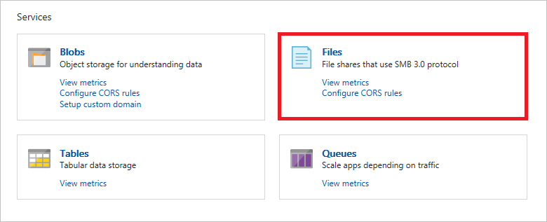

	_Opening file storage_

1. Click **+ File share**. Enter "myfileshare" for the file-share name. Leave **Quota** blank, and then click **OK**.

	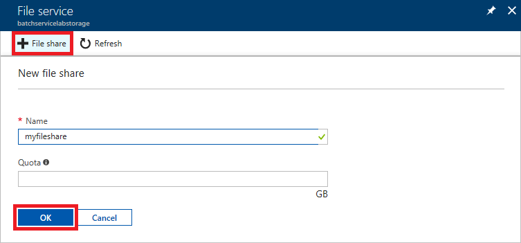

	_Creating a file share_

1. Click the new file share to open it.

	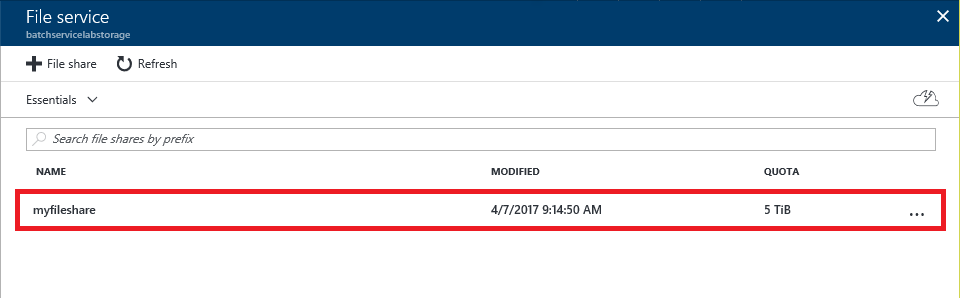

	_Opening the file share_

1. In the blade for the file share, click **+ Add directory**. Enter "textfiles" for the directory name, and then click **OK**.

	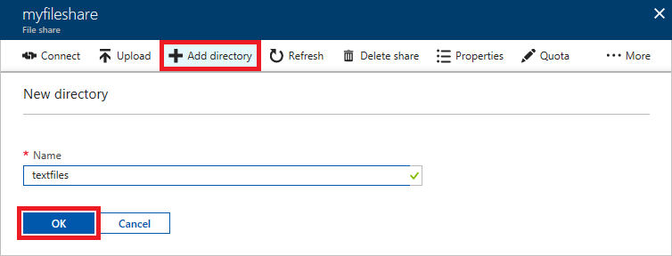

	_Creating a directory_ 

1. Back on the "myfileshare" blade, click the directory that you just created.

	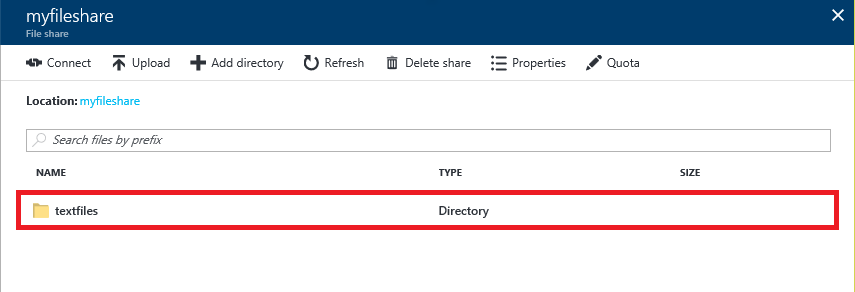

	_Opening the directory_

1. Click **Upload**.

	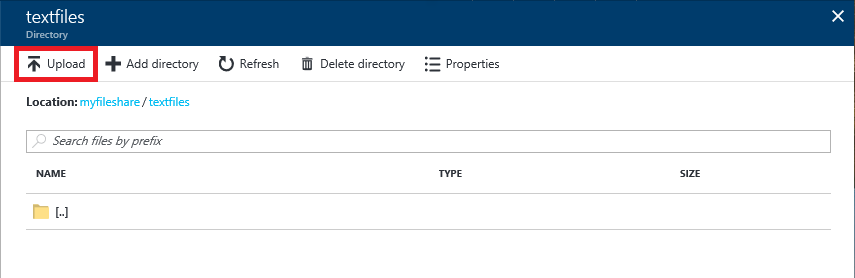

	_Uploading to the directory_

1. In the "Upload files" blade, click the **folder** icon. Select all of the .txt files in the resources that accompany this lab, and then click the **Upload** button.

	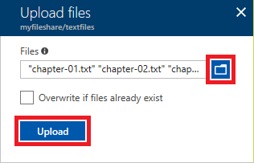

	_Uploading text files_

1. Wait for the uploads to complete. Then confirm that five files were uploaded to the "textfiles" directory.

	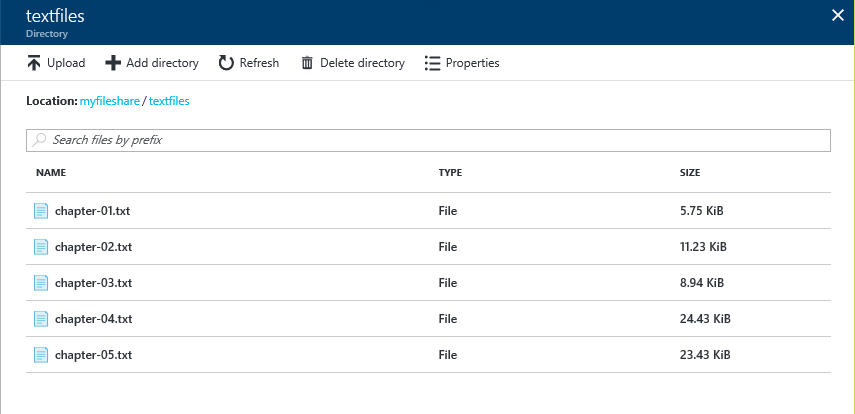

	_The uploaded text files_

The container is configured to handle multiple text files with a .txt extension. For each text file, the container will generate a corresponding .ogg file in the root folder.

<a id="Exercise6"/></a>
## Exercise 6: Run the job ##

Now that Batch Shipyard is configured, the pool is created, and the input data is uploaded, it's time to run the job.

1. Return to the Cloud Shell Prompt window and execute the following command. This command creates a job if it doesn't already exist in the Batch account, and then creates a new task for that job. Jobs can be run multiple times without creating new jobs. Batch Shipyard simply creates a new task each time the **jobs add** command is called.


	````
	shipyard jobs add --configdir config
	````


1. Return to the Azure Portal and open the Batch account.

	

	_Opening the batch account_

1. Click **Jobs** in the menu on the left side of blade, and then click **batch-lab-job**.

	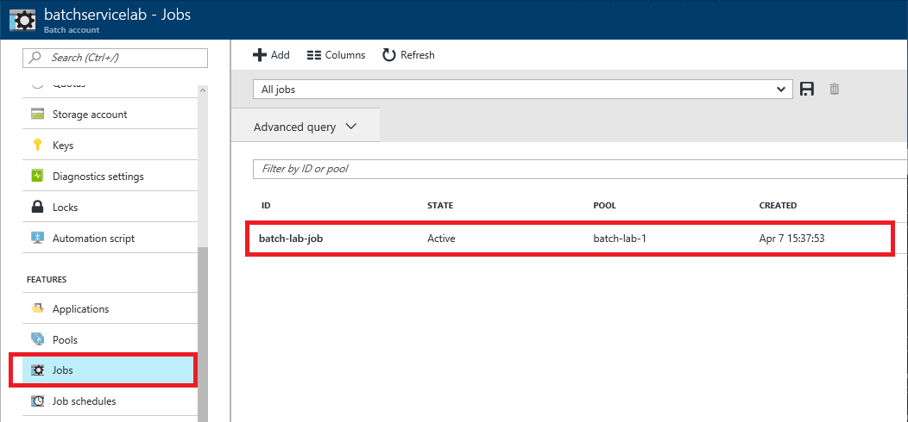

	_Selecting the job_

1. Click **Tasks**. Then click **Refresh** periodically until the job completes with an exit code of 0.

	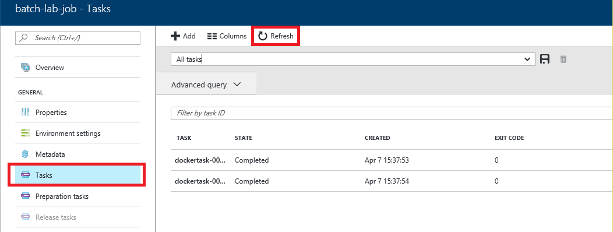

	_Waiting for the job to complete_

Once the job has finished running, the next step is to examine the output that it produced.

<a id="Exercise7"/></a>
## Exercise 7: View the results ##

The results are now available in the storage account. The output files can be downloaded and played back locally in any media player that supports the .ogg file type.

1. In the Azure Portal, return to the "BatchResourceGroup" resource group and click the storage account in that resource group.

	

	_Opening the storage account_

1. Click **Files**.

	

	_Opening file storage_

1. Click **myfileshare**.

	

	_Opening the file share_

1. Confirm that the file share contains five files named **chapter-01.ogg**, **chapter-02.ogg**, and so on. Click one of them to open a blade for it.

	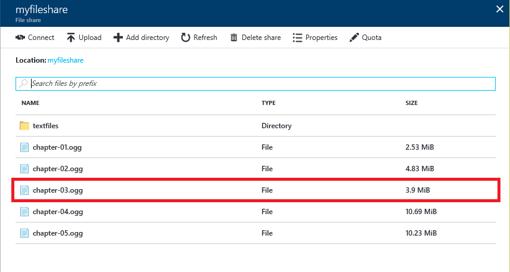

	_Opening the output file_

1. Click **Download** to download the file. This will download the file to the local machine where it can be played back in a media player.

	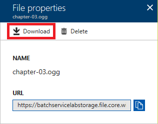

	_Downloading the results_

Each .ogg file contains spoken content generated from the text in the input files. Play the downloaded file in a media player. Can you guess what famous novel the content came from?

<a id="Exercise8"/></a>
## Exercise 8: Delete the resource group ##

In this exercise, you will delete the resource group created in [Exercise 1](#Exercise1) when you created the Batch account. Deleting the resource group deletes everything in it and prevents any further charges from being incurred for it.

1. In the Azure Portal, open the blade for the resource group created for the Batch account. Then click the **Delete** button at the top of the blade.

	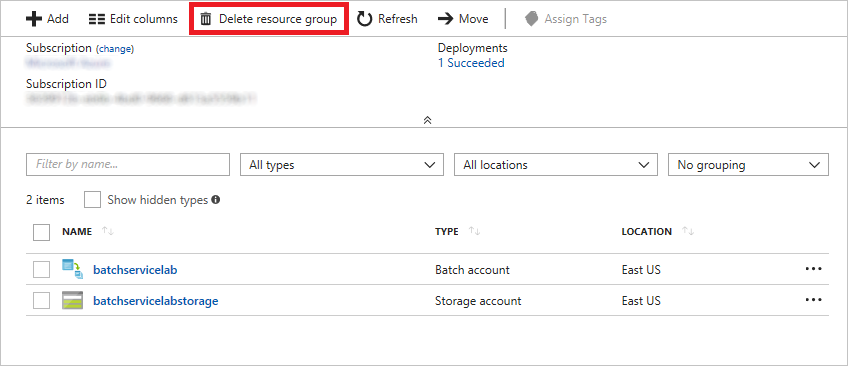

	_Deleting the resource group_

1. For safety, you are required to type in the resource group's name. (Once deleted, a resource group cannot be recovered.) Type the name of the resource group. Then click the **Delete** button to remove all traces of this lab from your account.

After a few minutes, the resource group and all of its resources will be deleted.

<a name="Summary"></a>
## Summary ##

Azure Batch is ideal for running large jobs that are compute-intensive as batch jobs on clusters of virtual machines. Batch Shipyard improves on Azure Batch by running those same jobs in Docker containers. The exercises you performed here demonstrate the basic steps required to create a Batch service, configure Batch Shipyard using a custom recipe, and run a job. The Batch Shipyard team has prepared other recipes involving scenarios such as deep learning, computational fluid dynamics, molecular dynamics, and video processing. For more information, and to view the recipes themselves, see https://github.com/Azure/batch-shipyard/tree/master/recipes.
